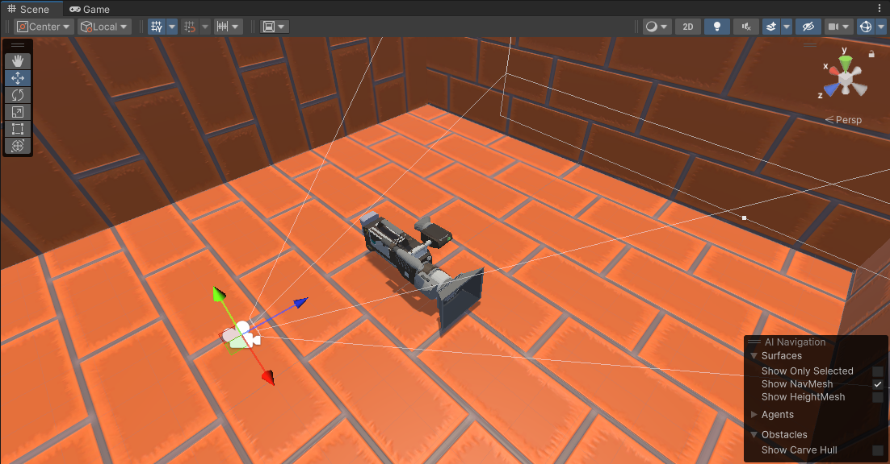
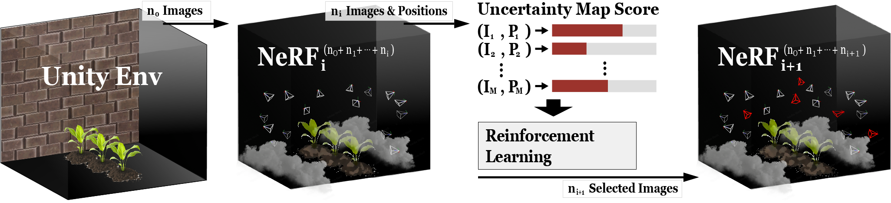

# AgriSim-virtual-NeRF-training

This repository provides a pipeline that uses reinforcement learning to find the optimal image positions necessary for training the NeRF model. The pipeline begins with the AgriSim module, a Python library that generates a NeRF of a ShapeNet 3D object using the Unity Game Engine and Instant-NGP. It starts with a basic Unity environment, where a 3D mesh object is simulated within the Unity framework. AgriSim's `unity_sampler` captures images of the target object within the Unity environment and saves these images with **`transforms.json`**, which contains translation, rotation, and the physical characteristics of the camera.

Using this dataset, the reinforcement learning agent within the AgriSim-RL module seeks to find the most effective positions of images for the training of the NeRF model. At each step, the agent predicts the camera position coordinates, and trains the NeRF model using images captured from these coordinates. After training, the agent's reward is assessed using validation metrics of the model, and the agent aims to increase the validation performance of the NeRF model.

The following figure shows how AgriSim-RL works. It initially samples `n_0` images and the RL agent selects new images iteratively. Our goal is NeRF model trained with AgriSim-RL using `n_0 + ... + n_k = N` images outperforms the model trained with `N' > N` images.

##### AgriSim-RL Process:

The future goal is to adopt uncertainty map algorithms to enable the RL agent to predict the optimal image positions more effectively. Calculating the uncertainty score of the NeRF scene allows the RL agent to observe and identify locations with high uncertainty prioritize predicting this part.

## Roadmap

* [X] Implementation of Unity sampler
* [X] Instant-ngp training with unity dataset
* [X] Implementation of RL framework
* [X] Baseline Training
* [X] AgriSim-RL training with Instant-ngp
* [ ] Implementation of Uncertainty map
* [ ] AgriSim-RL training with uncertainty map score
* [ ] Comparison experiment with other NeRF models

## Acknowledgments

This project makes use of a number of awesome open source libraries, including:

* [instant-ngp](https://github.com/NVlabs/instant-ngp?tab=readme-ov-file) for Instant Neural Graphics Primitives.
* [unity-python](https://github.com/exodrifter/unity-python) for framework integration support.
* [peaceful-pie](https://github.com/hughperkins/peaceful-pie) for framework integration support.
